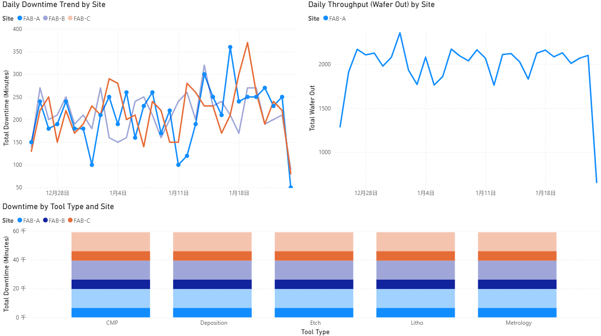

# Ops Insights

Ops Insights simulates a manufacturing equipment event pipeline: generate events, run ETL, load a SQLite warehouse, and publish marts for analytics and BI.

## What this project simulates
- Manufacturing equipment event pipeline with Run/Down/Idle states
- ETL that transforms raw events into daily KPIs and downtime summaries

## How to run
```bash
py -m src.main --generate-data --run-etl
```

## Output artifacts
- `output/warehouse.db` (SQLite warehouse with `events` table)
- `output/marts/mart_daily_kpi.csv`
- `output/marts/mart_downtime_by_tooltype.csv`

## SQL queries (in `sql/`)
- `01_daily_downtime_by_site.sql`: Daily downtime minutes and Down counts by site
- `02_downtime_by_tool_type.sql`: Total downtime by tool type (ranked)
- `03_daily_throughput_by_site.sql`: Daily throughput and Run counts by site
- `04_top_tools_by_downtime.sql`: Top 10 tools by downtime minutes

## Power BI steps
1. Import `output/marts/mart_daily_kpi.csv` and `output/marts/mart_downtime_by_tooltype.csv`.
2. Build three visuals:
   - Line chart: `date` vs `downtime_minutes`
   - Clustered column: `site` vs `total_wafer_out`
   - Bar chart: `tool_type` vs `downtime_minutes`
3. Export and embed the dashboard screenshot:



## Mapping to job requirements
- Python scripting: data generation, ETL orchestration
- SQL queries: SQLite analysis under `sql/`
- Power BI dashboard: marts consumption and visuals
- Docker basics: containerization via `Dockerfile` and `docker-compose.yml`
- Debugging/docs: logging and concise documentation
